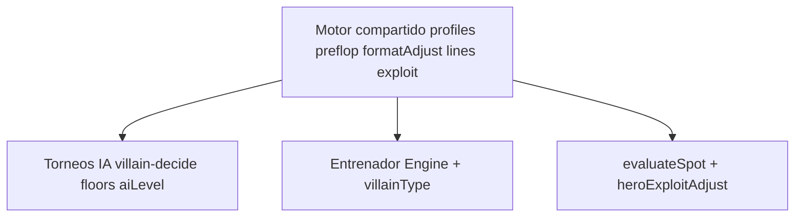

# Auditoría — Juego de villanos en torneos

> Fecha: 2026-10-05  
> Superficie principal: **Torneos IA** (MTT / SNG / Spin / HU).  
> Motor: **compartido** con Entrenador (`villainProfiles`, `villainPreflop`, `villainFormatAdjust`, `heroExploitAdjust`, …).  
> Artefacto de sim: [`tools/audit-out/villain-calib.json`](../tools/audit-out/villain-calib.json) — **calibración/regresión, no solver**.

---

## 1. Resumen ejecutivo

Antes de esta auditoría, en mesas Torneos IA con `aiLevel: elite` **todos los arquetipos colapsaban** a ~22 % VPIP / ~16 % PFR / ~4 % 3bet. La causa raíz era `applyDifficulty(..., keepArchetype)` con `biasScale: 0.06` y `preflopStrict` alto, que anulaba la identidad de fish/nit/lag/maniac, más opens 100 % chart sin widen/skip por perfil.

Tras los ajustes del motor compartido:

| Rol | VPIP early | PFR | 3bet | Steal | Separable |
|-----|------------|-----|------|-------|-----------|
| nit | ~18 | ~13 | ~4 | ~27 | Sí (tight) |
| fish | ~39 | ~18 | ~3 | ~50 | Sí (loose-pasivo) |
| tag | ~27 | ~18 | ~4 | ~48 | Parcial (3bet bajo) |
| lag | ~39 | ~25 | ~14 | ~58 | Sí |
| maniac | ~45 | ~28 | ~17 | ~58–64 | Sí |
| **pro** | **~29** | **~22** | **~11** | **~48** | Sí (presión + charts) |

**Pro early:** VPIP/PFR/3bet/steal/BB-def/cbet/fold-to-3bet en banda. Push VPIP ~25 (antes ~11 Nash). HU basura (Q2o) sigue fold.

---

## 2. Principio: torneos primero, motor único



- Los cambios de comportamiento van a módulos **compartidos**.
- `tournamentPostflopFloor` solo acota postflop de mesa completa; se recalibró para **no forzar** fish/nit hacia TAG.
- El Entrenador con `villainType` fijo + `villainLevel: pro` hereda la misma retención de arquetipo.

---

## 3. Benchmarks de referencia

Definidos en [`tools/audit-villain-tournament-benchmarks.js`](../tools/audit-villain-tournament-benchmarks.js) (early / short / push). Bandas orientativas de field online / regs / pros — **no son solver exacto**.

Pro early objetivo: VPIP 22–30 · PFR 18–24 · 3bet 6–12 · steal 42–55 · BB def 40–58 · cbet 60–75 · push VPIP 22–36.

---

## 4. Mapa de parámetros (antes → después)

### Compartido — [`js/engine/villainProfiles.js`](../js/engine/villainProfiles.js)

| Pieza | Antes | Después |
|-------|-------|---------|
| `applyDifficulty` forced+pro | `biasScale 0.06` para **todos** | `pro`: scale 1 + strict 0.9; **otros**: scale 0.82 + strict 0.52 |
| Sesgos `pro` preflop | fold +0.02, 3bet +0.05, call −0.02 | fold −0.02, 3bet +0.14, call +0.05 |
| Postflop `pro` | bet 1.14 / bluff 0.92 / raise 1.28 | bet 1.62 / bluff 1.32 / raise 1.42 + XR/overbet ↑ |
| `adjust*Prob` scale | `1 - strict` → ~0 con strict 0.92 | suelo `max(0.28, …)` / 0.12 si strict≈1 |
| `openStyle` | no existía | widen/skip por rol |

### Compartido — [`js/engine/villainPreflop.js`](../js/engine/villainPreflop.js)

- Nuevo `shouldOpen(code, pos, ctx, profile, holeStr)` — chart + widen/skip.
- `defendVsOpen` ensancha/aprieta por `callBias` / `threeBetBias` / `foldBias`; off-chart call/3bet proporcional al perfil (fish llama, pro/lag presionan).

### Torneo — [`js/tournament/villain-decide.js`](../js/tournament/villain-decide.js)

- Opens vía `shouldOpen` (no solo chart).
- Floors postflop: fish/nit con **techo** de agresión; pro/tag/lag con suelo de presión (ya no fish.bet ≥ 1.05).

### Evaluación — [`js/engine/heroExploitAdjust.js`](../js/engine/heroExploitAdjust.js)

- `pro` ya no se excluye de `shouldApply`.
- Multiplicadores lite + copy «GTO + exploit selectivo».
- `scoreMode: 'gto'` sigue siendo baseline puro (+ line-lite).

---

## 5. Resultados de simulación

Harness: `node tools/audit-villain-tournament-sim.js`  
Volumen baseline pre-fix: 1200 manos/celda · post-fix: 1500 manos/celda · mono-rol 6-max.

### Hallazgos por situación

| Situación | Fallo previo | Estado actual | Residual |
|-----------|--------------|---------------|----------|
| Open early | Todos ~16 % PFR | Roles separados; pro ~23 % PFR | Tag 3bet chart aún estrecho |
| Steal mid/late | Todos ~34 % | Nit ~27 · pro ~52 · lag/maniac 58–64 | Fish steal algo alto (widen) |
| BB vs open | Todos ~40 % defend | Fish alto · pro ~40 % | OK en banda revisada |
| 3bet | Todos ~4 % | **Pro early ~11 %**; lag/maniac ↑ | Tag chart-tight |
| Fold to 3bet | 85–95 % | **Pro ~60 %** | OK |
| Cbet flop | Planos / bajos | **Pro early ~61 %** | Short a veces ~56 % |
| Push ≤12 bb | VPIP ~11 % todos | **~25 %** con jam widen late | Nash early + widen late |
| Bubble | Similar a short | Fold bias ICM activo | Cubrir/covered asimetría a seguir midiendo |
| Identidad roles | **Colapso total** | **Separados** | TAG algo “laggy” en VPIP |

### Pro — profundidad

- **Presión:** 3bet **~11 %** (banda 6–12) y steal ~48 % early — creíble para reg/pro MTT. Rango polar: value (QQ+/AK) + light (Ax s, broadways, SC fuertes); no Q2o.
- **Composición preflop:** parte del calling range pasa a 3bet light; off-chart 3bet solo si `speculativeThreeBetOk` (gate trash para pro/tag/nit).
- **Postflop:** más pots 3bet (SPR bajo) → cbet/XR/overbet del perfil pro pesan más; fold-to-3bet ~60 % alinea continue vs presión del hero.
- **Evaluación:** exploit vs `villainType: pro` = híbrido (`pro_hybrid`): ↓ bluff/3bet-bluff, ↑ value/call-down frente a presión. `scoreMode: 'gto'` sigue baseline puro.

---

## 6. Política de cambios shared vs torneo

| Cambio | Dónde | ¿Por qué no solo torneo? |
|--------|-------|---------------------------|
| Retención arquetipo | `villainProfiles` | Entrenador `villainType` + nivel pro debe sentir el mismo estilo |
| `shouldOpen` / defend biases | `villainPreflop` | Misma fuente de verdad preflop |
| Floors fish/nit | `villain-decide` | Solo mesa completa; entrenador no usa esos floors |
| Pro exploit-lite | `heroExploitAdjust` | Puntuación alineada con cómo juega el villano pro |

---

## 7. Evaluación pro = GTO + explotativo

| `villainType` × `scoreMode` | Primario | Dual |
|-----------------------------|----------|------|
| `pro` × `gto` | GTO (+ line-lite) | Exploit-lite pro |
| `pro` × `exploit` | **Pro híbrido** (GTO + selectivo) | Igual / coherente |
| `fish`/`nit`/… × `exploit` | Arquetipo fuerte (sin cambio de filosofía) | — |
| Torneos revisión UI | Primario GTO (contrato actual) | Dual enriquecido con pro híbrido |

---

## 8. Veredicto del JSON de simulación

**No** usar el JSON como camino a “parecer un solver”: es HUD agregado (frecuencias de población), sin árboles combo×nodo ni EV CFR.

**Sí** usarlo para:

1. Calibrar sesgos/floors (este audit).
2. Bandas de regresión (`--assert-bands` / CI): VPIP/PFR/3bet **y frecuencias de apuesta por tipo** (cbet / AF / XR + identidad relativa).
3. Documentar HUD esperado por rol×fase.

La cercanía a solver sigue siendo charts auditados + postflop heurístico consciente de límites ([`AUDIT_RANGES_VS_CONSENSUS.md`](AUDIT_RANGES_VS_CONSENSUS.md), [`DECISION_ENTRENADOR_MTT_SPIN.md`](DECISION_ENTRENADOR_MTT_SPIN.md)).

---

## 9. Cómo reproducir

```bash
npm run audit:villain-tournament          # quick
npm run audit:villain-tournament:assert   # frecuencias de apuesta por tipo + assert-bands
node tools/audit-villain-tournament-sim.js --full --out tools/audit-out/villain-calib.json
node tools/test-audit-villain-tournament-sim.js
node tools/test-audit-villain-bet-freqs.js
```

---

## 10. Backlog residual (no bloqueante)

1. TAG 3bet más cercano a 6–9 % sin convertirlo en LAG.
2. Sim bubble covered vs short con stacks asimétricos (no solo mono-stack).
3. Cbet short a veces ~56 % (banda 58–75): holgura menor.
