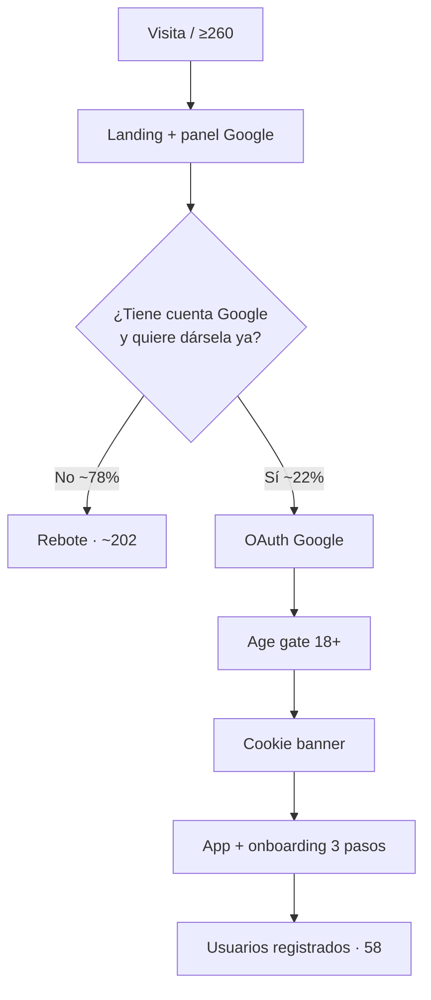

# Estudio: landing inicial sin registro — PokerForgeAI

> Diagnóstico de conversión (visitas → registro) y roadmap para una **primera pantalla más simple, más atractiva y usable sin cuenta**.  
> Datos de partida: **≥260 personas en la landing** y **58 usuarios registrados** (~**22 %**).  
> Complementa [`ESTUDIO_PRODUCTO_Y_MERCADO_AGOSTO_2026.md`](./ESTUDIO_PRODUCTO_Y_MERCADO_AGOSTO_2026.md) (P0 #4 landing + #5 onboarding) y SN-54 (comparativa Snowie).  
> Fecha: agosto 2026 · Código revisado: `index.html`, `js/landing.js`, `js/auth.js`, `js/auth-bootstrap.js`, `css/styles.css`.

---

## Tabla de contenidos

1. [Veredicto](#1-veredicto)
2. [Funnel: 260 visitas → 58 registros](#2-funnel-260-visitas--58-registros)
3. [Auditoría de la landing actual](#3-auditoría-de-la-landing-actual)
4. [Qué hace el mercado (y qué no hacemos)](#4-qué-hace-el-mercado-y-qué-no-hacemos)
5. [Propuesta de experiencia](#5-propuesta-de-experiencia)
6. [Diseño técnico del modo invitado](#6-diseño-técnico-del-modo-invitado)
7. [Roadmap](#7-roadmap)
8. [Métricas de éxito](#8-métricas-de-éxito)
9. [Riesgos y no-hacer](#9-riesgos-y-no-hacer)
10. [Criterios de aceptación por entrega](#10-criterios-de-aceptación-por-entrega)

---

## 1. Veredicto

El producto **ya es valioso**. El problema no es “falta de features en la landing”, es **pedir Google antes de mostrar el valor**.

Hoy el visitante ve un muro de texto + un panel de “Continuar con Google” y **nunca ve la mesa, una mano, ni una fuga**. La sesión demo (`js/sample-session.js`) y el onboarding de 3 pasos existen, pero **solo después del registro**. Eso explica la mayor parte del drop-off.

| Dato | Lectura |
|------|---------|
| 58 / 260 ≈ **22 %** visita → registro | Aceptable para tráfico cálido (foros, conocidos) con **login Google obligatorio**. Malo si queremos crecer con tráfico frío (SEO, ads, Twitter). |
| **~202 personas** se fueron sin cuenta | No vieron el entrenador. No hay “aha”. No hay motivo para volver. |
| Objetivo realista post-roadmap | **35–45 %** visita → cuenta **después de probar**, no un 80 % de “Empezar gratis → OAuth inmediato”. |

**Apuesta:** invertir el orden. Primero **3–5 manos en la mesa (invitado)**. Luego “Guarda tu progreso con Google”. El registro deja de ser un peaje y pasa a ser **guardar lo que ya les gustó**.

El 22 % no es un fracaso de canal: es el techo típico de un **hard gate**. Subir registros con la misma landing actual (más CTAs, más texto FOUNDER) **no** va a mover el número. Hay que dejar **probar sin cuenta**.

---

## 2. Funnel: 260 visitas → 58 registros

### 2.1 Embudo actual (reconstruido desde código)



No hay eventos intermedios en Plausible (`js/analytics.js` solo trackea `register` / `login` **después** de autenticar). No sabemos cuántos pulsan “Empezar gratis”, cuántos abandonan OAuth, ni cuántos rechazan el age-gate. El 22 % es un **agregado ciego**.

### 2.2 Lectura del 22 %

| Interpretación | Implicación |
|----------------|-------------|
| Tráfico **motivado** (enlace directo, promo, boca a boca) | 22 % es razonable; el problema es el **techo**: quien duda no prueba. |
| Tráfico **SEO / frío** mezclado | 22 % ya es alto para cold; igual hay bots/reloads en el 260. Aun así, 202 no-registros son oportunidad. |
| Google-only + “beta / FOUNDER / código” | Perciben producto **cerrado o inacabado**. “Empezar gratis” miente: no empiezas, **te registras**. |

Benchmarks orientativos (SaaS B2C con OAuth):

| Modelo | Visita → cuenta |
|--------|-----------------|
| Hard gate (login antes de usar) | 15–25 % en tráfico cálido |
| Product-led: prueba 2 min → “guarda progreso” | 30–50 % de quienes **empiezan** la prueba |
| Email + password clásico en landing | suele **bajar** vs Google si el valor no se ha visto |

Conclusión: **no optimizar el botón de Google**. Optimizar el **tiempo hasta la primera mano**.

### 2.3 Hipótesis de pérdida (ordenadas)

1. **No ven el producto** — cero captura de mesa, cero GIF, cero demo interactiva.
2. **Google como primer paso** — fricción + privacidad + “¿para qué doy mi Gmail si no sé qué es esto?”.
3. **Copy de beta/FOUNDER/código** en el hero — “aún no está listo / es por invitación”.
4. **Tres CTAs en el hero** (Empezar / Planes / Instalar) — diluye la acción.
5. **Desktop: 38 % del ancho es el panel de login sticky** — la historia del producto queda estrecha.
6. **Móvil: login al final** de una página larga (features + blog + planes + instalar) **o** OAuth inmediato al pulsar “Empezar gratis”.
7. **Mensaje contradictorio** — “Empieza sin fricción” vs compras pausadas, plazas FOUNDER, código de acceso, trial 10 días que no se puede comprar.
8. **Nav saturada** — 7 enlaces (Funciones, Planes, Instalar, Metodología, Blog, FAQ, Soporte) + Entrar.

---

## 3. Auditoría de la landing actual

### 3.1 Arquitectura

La landing **no es una página de marketing separada**: es `#auth-gate` encima de `#app-shell` (`body.auth-locked`). `PTAuth.requireAuth()` oculta la app hasta Google. Todo el JS de producto se carga igual (configs + `landing.js` + `auth-bootstrap.js` en el `<head>`).

| Pieza | Archivo | Efecto en conversión |
|-------|---------|----------------------|
| Hero + secciones | `index.html` ~L136–330 | Texto largo, sin visual del producto |
| CTAs → OAuth inmediato | `js/landing.js` `startLoginNow()` | “Empezar gratis” = popup Google |
| Panel sticky login | `.landing-layout` 1fr + 38vw | En ≥960px el login **nunca desaparece** |
| Promo código en hero | `#landing-promo-code` | Aspecto de beta cerrada |
| FOUNDER pill | `js/billing-config.js` `purchasesPaused: true` | “próximamente / plazas limitadas” |
| Age gate | `js/age-gate.js` | **Después** de OAuth (tarde; ya dieron la cuenta) |
| Sesión demo | `js/sample-session.js` | Solo con `userId` autenticado |
| Onboarding 3 pasos | `js/onboarding.js` | Solo post-login |
| Analytics funnel | `js/analytics.js` | No hay `landing_cta` / `guest_start` |

### 3.2 Primer viewport (lo que decide el 80 % del bounce)

**Desktop**

```
[Logo] [Funciones Planes Instalar Metodología Blog FAQ Soporte] [Entrar]
[Píldora FOUNDER próximamente · 40% dto · plazas limitadas]
H1  Entrena GTO, importa tus sesiones y mejora con ForgeCoach
Lead (3 ideas: mesa + import heurístico + PWA)
[Empezar gratis] [Ver planes] [Instalar app]
¿Tienes un código de acceso?  [input] [Activar]
• Sesión de ejemplo incluida al registrarte
• Import 5 salas
• Plan gratis ahora · FOUNDER próximamente
                                              │ STICKY
                                              │ Entrar con Google
                                              │ Continuar con Google
```

Problemas de ese primer pantallazo:

1. **H1 con tres productos** (entrenar + import + ForgeCoach). El visitante no sabe qué hacer en 5 segundos.
2. **FOUNDER** es lo primero que se lee (píldora encima del H1).
3. **Código de acceso** ocupa más que la propuesta de valor. Quien no tiene código siente que **no es para él**.
4. El único “producto” visible es un **formulario de Google**, no una mesa.
5. Bullet 1: “incluida **al registrarte**” — confirma el peaje.
6. Bullet 3: “FOUNDER próximamente” — contradice “Empezar gratis”.

**Móvil (<960px)**

- Nav en chips; “Entrar” ancho completo.
- El panel Google **baja al final** de features + blog + pricing + instalar.
- “Empezar gratis” dispara OAuth **sin que hayan visto planes ni mesa**.
- Banner de cookies puede tapar el CTA inferior.

### 3.3 Copy: demasiadas historias a la vez

La landing cuenta **cinco narrativas** simultáneas:

| Narrativa | Dónde | Conflicto |
|-----------|--------|-----------|
| Producto listo, empieza gratis | H1, CTA | vs FOUNDER / compras cerradas |
| Beta con código de acceso | Hero form | vs plan gratis abierto |
| SaaS con Study €14,99 / Coach €34,99 | Pricing | botones Study/Coach **disabled** |
| PWA “instálala como app” | 3.er CTA + sección completa | competidor del CTA primario |
| Contenido SEO (blog, metodología, FAQ) | Nav + sección | diluye “prueba ahora” |

`limits.title` dice **“Empieza sin fricción”** y a continuación: 15 manos/día, FOUNDER, compras cerradas, solicita plaza. El visitante lee “fricción”.

### 3.4 Lo que ya está bien (no tirar)

- Español nativo, claim claro de import multi-sala.
- Plan Gratis visible (0 €).
- Legal, cookies, metodología, FAQ, PWA — confianza B2C.
- Pricing grid generado desde `PT_BILLING` (una fuente de verdad).
- CTA de nav y hero **sí disparan OAuth** (regresión cubierta en `tools/test-landing-login-cta.js` y `e2e/login-desktop.spec.js`).
- `Store` **ya namespacea por usuario y, si no hay `userId`, usa claves locales** (`js/storage.js` `scopedKey`). El modo invitado no parte de cero.

### 3.5 Peso percibido vs peso real

La landing parece “app pesada”: 18 scripts síncronos en `<head>` antes de pintar el login. Core Web Vitals (LCP) y “¿esto es una web de marketing o un panel a medio cargar?” importan en móvil. El roadmap de SEO ya lo marca; aquí es también **conversión**.

---

## 4. Qué hace el mercado (y qué no hacemos)

| Producto | Primera experiencia | Registro |
|----------|---------------------|----------|
| **GTO Wizard** | Biblioteca / trainer visible; trial claro | Cuenta para guardar y pagar |
| **PokerSnowie** | Trial ~10 días del producto completo | Cuenta, pero **juegas de inmediato** |
| **GTO Gecko / Lucid** | Free generoso o drills al momento | Soft gate |
| **Postflop+** | App; se siente el drill en el primer minuto | Tras el aha |
| **PokerForgeAI hoy** | Texto + Google | **Antes** de ver una carta |

El job-to-be-done #1 del estudio de agosto:

> “Quiero saber si juego bien sin pagar 100 $/mes.”

Eso se responde **jugando 3 manos y viendo “óptima / error”**, no leyendo “evaluación GTO calle a calle”.

La comparativa Snowie/Wizard (SN-54) **ayuda a quien ya compara**; **no** convierte a quien aún no entiende qué es el producto. Primero demo, después tabla.

---

## 5. Propuesta de experiencia

### 5.1 Principio

> **Una acción, un beneficio, una prueba.**  
> Landing corta → mesa en <10 s sin Google → registro para **guardar**, no para **entrar**.

### 5.2 Nueva estructura (above the fold)

```
[Logo PokerForgeAI]                    [Planes]  [Entrar]
Eyebrow: En español · sin tarjeta
H1: Juega 5 manos. Mira si aciertas.
Lead: Entrenador GTO en el navegador. Luego importa PokerStars, Winamax o GG.
[ Probar ahora — sin registro ]     [ Ver cómo funciona ↓ ]
[ Mock / mesa viva: 2 cartas + 3 botones Fold / Call / Raise + chip “Óptima” ]
• 5 manos de prueba  ·  Google solo para guardar  ·  Gratis para siempre con límites
```

Debajo del fold (orden fijo, poco scroll):

1. **Cómo funciona** — 3 pasos: juega → te puntúan → ves la fuga.
2. **Qué incluye** — 3 tarjetas (no 6): Entrenar, Importar sesiones, ForgeCoach.
3. **Planes** — Gratis destacado; Study/Coach como “cuando quieras más”; FOUNDER **aquí**, no en el hero.
4. **CTA final** — “Sigue en este dispositivo o guarda con Google”.
5. Footer legal + código promo **colapsado** (“¿Tienes código?”).

Fuera del primer pantallazo: Instalar PWA, blog, metodología, FAQ, comparativa Snowie.

### 5.3 Copy recomendado (ES)

| Elemento | Hoy | Propuesto |
|----------|-----|-----------|
| H1 | Entrena GTO, importa tus sesiones y mejora con ForgeCoach | **Juega 5 manos. Mira si aciertas.** |
| Lead | Tres ideas + PWA | Entrenador en el navegador, en español. Google solo si quieres guardar el progreso. |
| CTA primario | Empezar gratis → OAuth | **Probar ahora — sin registro** |
| CTA secundario | Ver planes / Instalar | Cómo funciona / Entrar (si ya tienes cuenta) |
| Promo código | Formulario en hero | Acordeón al pie o `?c=` / `promo.html` |
| FOUNDER | Pill en hero + pricing | Solo pricing + banner discreto |
| Login panel | Sticky 38 % siempre | Modal o aside **tras** clic en Entrar; en desktop no roba el hero |

### 5.4 Dos CTAs, no cinco

| CTA | Rol |
|-----|-----|
| **Probar ahora** | Invitado: abre `#app-shell` en pestaña Entrenar, 5 manos, sin OAuth |
| **Entrar** | Quien ya tiene cuenta → Google |

“Ver planes”, “Instalar”, “Activar código”, “Solicitar FOUNDER” **no** compiten en el hero.

### 5.5 Soft-gate (cuándo pedir Google)

Pedir cuenta **después** de valor, en este orden de disparadores (el primero que ocurra):

1. Terminó las **5 manos** de prueba → modal “Guarda tu acierto (p. ej. 3/5) con Google”.
2. Quiere **importar** un `.txt` o ForgeCoach.
3. Quiere **más manos** (6.ª).
4. Cambia de dispositivo / pide sync.

No pedir Google al pulsar “Probar ahora”. No pedir age-gate **después** de OAuth como sorpresa: checkbox “Soy mayor de 18 años” **en el modal de registro** (y opcionalmente un aviso corto al entrar como invitado).

### 5.6 Qué hacer con FOUNDER y el código

Mientras `purchasesPaused: true`:

- Hero: **cero** mención a FOUNDER / “compras cerradas”.
- Pricing: una frase honesta — “Gratis ahora. Study y Coach con plazas FOUNDER cuando abras pagos.”
- Código: no es un CTA de adquisición masiva; es un **flujo de campaña** (`promo.html?c=`). Quitar el formulario del hero **no** rompe campañas si `?c=` / `?promo=` sigue funcionando (`landing.js` ya lo captura).

---

## 6. Diseño técnico del modo invitado

### 6.1 Hallazgo importante

`Store.scopedKey()` **ya funciona sin login**:

```23:26:js/storage.js
  function scopedKey(base) {
    if (userId) return KEY_PREFIX + base + KEY_SUFFIX + '_' + userId;
    return KEY_PREFIX + base + KEY_SUFFIX;
  }
```

El motor, la mesa y el localStorage no exigen Google. El muro es **solo UI**: `requireAuth` no llama a `onReady` si no hay sesión, y `#app-shell` permanece `hidden`.

### 6.2 Modelo propuesto

| Concepto | Valor |
|----------|--------|
| Usuario invitado | `userId = 'pt_guest_local'` (constante, no anónimo infinito) |
| Límite | 5 manos de entrenador **por dispositivo** (`localStorage`) |
| Persistencia | Local; **no** sync Supabase, **no** IA, **no** import, **no** admin |
| Banner | “Estás probando sin cuenta · 3/5 manos · [Guardar con Google]” |
| Merge al login | `Store.migrateLocalUserKeys('pt_guest_local', user.sub)` — **ya existe** `migrateLocalUserKeys` |
| Age | Aviso 18+ al entrar a la mesa; confirmación formal al registrar |

### 6.3 Cambios de código (alcance L2)

| Archivo | Cambio |
|---------|--------|
| `js/auth.js` | `enterGuest()` → `setAppVisible(true)` sin OAuth; `getUser()` distingue guest |
| `js/landing.js` | CTA primario → `enterGuest`; `[data-landing-login]` sigue en OAuth |
| `js/app.js` | Si guest: solo tab Entrenar (+ Home mínimo); resto pide login |
| `js/billing.js` | Guest = plan free con cupo 5 manos (no 15) |
| `js/analytics.js` | `guest_start`, `guest_hand`, `guest_gate`, `guest_convert` |
| `js/sample-session.js` | Opcional L3: seed demo **sin** user auth |
| `index.html` | Hero nuevo; panel login no sticky por defecto |
| E2E | `e2e/guest-landing.spec.js`: Probar ahora → mesa visible sin OAuth |

### 6.4 Lo que no tocar en L2

- RLS / Supabase (el guest no escribe en nube).
- Stripe / FOUNDER.
- Escuela, rangos, análisis, coach.
- Sustituir Google por email/password (añade fricción **después** del aha; no es el cuello de botella).

---

## 7. Roadmap

Prioridad = impacto en **registros de gente que hoy rebota**, no en features de producto profundo.

```
L0  Landing simple (copy + layout)     ← se puede hacer ya, sin modo invitado
L1  Visual del producto en el hero
L2  Modo invitado 5 manos + soft-gate   ← palanca principal 22 % → 35 %+
L3  Instrumentar funnel + merge guest
L4  Comparativa + prueba social + PWA   ← SN-54 y P0 #4 del estudio de agosto
```

L0–L1 mejoran percepción. **L2 es el cambio de conversión.** L3 evita volver a adivinar. L4 convierte a quien ya comparó Snowie/Wizard.

### Fase L0 — Landing simple (copy y jerarquía)

**Objetivo:** una historia, un CTA, hero sin ruido de beta.

| ID | Entrega | Esfuerzo | Dependencia |
|----|---------|----------|-------------|
| **L-01** | H1 + lead + un CTA primario + “Entrar” secundario | S | — |
| **L-02** | Sacar del hero: código promo, pill FOUNDER, CTA Instalar | S | L-01 |
| **L-03** | Nav corta: Planes + Entrar (+ menú “Más”: blog, legal, instalar) | S | — |
| **L-04** | Panel Google **no sticky** en desktop: se abre al pulsar Entrar (modal/aside) | M | tests login desktop |
| **L-05** | Pricing: Gratis como camino; FOUNDER solo en esa sección; copy “Empieza sin fricción” alineado con la realidad | S | L-02 |
| **L-06** | Código promo: acordeón al pie; `?c=` / `promo.html` intactos | S | — |

**DoD L0:** primer viewport sin FOUNDER, sin input de código, sin tres botones equivalentes. “Empezar” aún puede ser OAuth **temporalmente** (si L2 no va en el mismo PR), pero el copy no promete “sin fricción” si pide Google.

### Fase L1 — Atractivo visual

**Objetivo:** entender el producto en 3 segundos sin leer.

| ID | Entrega | Esfuerzo |
|----|---------|----------|
| **L-10** | Mock estático de mesa (2 hole cards + acciones + badge Óptima/Error) en el hero | M |
| **L-11** | Captura OG 1200×630 (`og-share.png`) — ya listado en `docs/SEO.md` | S |
| **L-12** | Sección “Cómo funciona” en 3 pasos con captura real (no 6 feature cards) | S |
| **L-13** | Features: 3 pilares (Entrenar / Importar / ForgeCoach); el resto en “Más” | S |

Sin L1, L0 sigue siendo un muro de texto. Un mock CSS (sin motor) basta; no hace falta WebGL.

### Fase L2 — Sin registro (palanca)

**Objetivo:** primera mano sin Google. Registro = guardar.

| ID | Entrega | Esfuerzo |
|----|---------|----------|
| **L-20** | `enterGuest()` + banner de prueba + límite 5 manos | M |
| **L-21** | CTA hero “Probar ahora — sin registro”; Entrar = Google | S |
| **L-22** | Soft-gate al 5.º / import / IA | M |
| **L-23** | Tabs bloqueadas en guest con mensaje “Guarda para importar / ForgeCoach” | S |
| **L-24** | Checkbox 18+ en el flujo de registro; aviso breve en guest | S |
| **L-25** | E2E guest + no romper `login-desktop.spec.js` | M |

**DoD L2:** usuario nuevo en móvil abre `/`, pulsa Probar, ve la mesa y completa ≥1 decisión **sin popup de Google**.

### Fase L3 — Datos y continuidad

**Objetivo:** medir el embudo y no perder el progreso del invitado.

| ID | Entrega | Esfuerzo |
|----|---------|----------|
| **L-30** | Eventos Plausible: `landing_view`, `cta_try`, `cta_login`, `guest_start`, `guest_hand`, `guest_gate_shown`, `guest_convert`, `register` | S |
| **L-31** | Merge `pt_guest_local` → `user.sub` al primer login (reutilizar `migrateLocalUserKeys`) | M |
| **L-32** | Admin: no contar guests como usuarios; opcionalmente “conversiones guest→cuenta” | S |
| **L-33** | Lazy-load: no bloquear LCP de landing con chunks de escuela/admin | M |

**DoD L3:** se puede responder “de 100 visitas, cuántas prueban, cuántas ven el gate, cuántas registran”.

### Fase L4 — Confianza y comparativa

**Objetivo:** convertir al visitante que **ya** entiende el producto y compara alternativas.

| ID | Entrega | Relación |
|----|---------|----------|
| **L-40** | Tabla honesta vs Snowie / Wizard | SN-54 |
| **L-41** | Prueba social honesta (“58 jugadores en beta” / manos entrenadas, **sin inventar**) | — |
| **L-42** | Instalar PWA **después** de la primera mano, no en el hero | SN-50 hecho; copy |
| **L-43** | Onboarding 3 pasos también para guest (demo → 5 manos → “guarda para ver fugas”) | P0 #5 estudio agosto |

L4 **después** de L2. Una tabla comparativa en una landing que pide Google primero no arregla el 22 %.

### Orden de PRs recomendado

```
PR1  L0 copy+nav+hero limpio          (bajo riesgo, tests landing/i18n)
PR2  L1 mock mesa + 3 pilares
PR3  L2 guest 5 manos + soft-gate     (el que mueve el 22 %)
PR4  L3 analytics + merge
PR5  L4 SN-54 + social proof
```

No mezclar L2 con un rediseño visual grande: si algo rompe OAuth, el rollback debe ser claro.

### Fuera de este roadmap (no es el cuello)

- Email/password, Apple Sign-In, magic link.
- Trial Stripe 10 días (sí es P0 de **pago**, no de **registro**).
- Import GG / modo sesión 25-50-100 (activación **post-cuenta**).
- i18n EN de toda la app.
- Apps nativas.

Esos ítems siguen en el estudio de agosto; **no** desbloquean a las 202 personas que no se registraron.

---

## 8. Métricas de éxito

Definir **una semana de baseline** (L3) antes de celebrar L2.

| Métrica | Hoy (aprox.) | Meta tras L2+L3 |
|---------|----------------|-----------------|
| Visita landing → registro | ~22 % (58/260) | **35 %** |
| Visita → clic “Probar” | desconocido | **>40 %** de únicos |
| Clic Probar → 1.ª decisión | n/a | **>70 %** |
| Guest que ve gate → Google | n/a | **>40 %** |
| OAuth iniciado → cuenta creada | desconocido | medir; si &lt;70 %, el problema es Google/age-gate, no la landing |
| Bounce en `/` (Plausible) | desconocido | bajar frente a baseline L0 |

**Cuidado con el denominador:** 260 puede incluir recargas, previews de Slack, crawlers. Usar **visitantes únicos** Plausible (con consentimiento) + `register` ya existente.

No usar “más clics en Empezar gratis” como éxito si ese botón sigue siendo OAuth: inflar clics sin registros es vanidad.

---

## 9. Riesgos y no-hacer

| Riesgo | Mitigación |
|--------|------------|
| Guest usa 5 manos y se va igual | El gate debe mostrar **su** resultado (“3 de 5 óptimas”) no un slogan |
| Merge guest pisa datos de una cuenta vieja en el mismo browser | Solo migrar si la cuenta es **nueva** o el cloud está vacío; si hay conflicto, preguntar |
| Abuse: recargar para otras 5 manos | Límite por `localStorage` + flag; no es crítico en beta (no hay coste solver) |
| Legal 18+ en modo invitado | Aviso visible + bloqueo de registro sin checkbox; el poker + IA ya está en Términos |
| “Empezar gratis” y “Probar sin registro” a la vez | Un solo primario |
| Rediseño estético infinito | L1 es un mock de mesa, no un rebrand |
| Pedir email además de Google | Empeora el 22 % |
| Meter FOUNDER otra vez en el hero “para urgencia” | Urgencia de **invitación** mata adquisición abierta |

**No-hacer**

- Landing one-page de 3.000 palabras con más features.
- Video autoplay pesado antes de medir LCP.
- Contador falso de usuarios.
- Quitar el login: quien vuelve **debe** poder pulsar Entrar y listo.

---

## 10. Criterios de aceptación por entrega

### L0 (landing simple)

- [ ] Hero: un H1, un lead, un botón primario, un secundario “Entrar”.
- [ ] No hay formulario de código ni pill FOUNDER above the fold.
- [ ] Nav ≤ 3 acciones principales.
- [ ] `?c=` y `promo.html` siguen canjeando.
- [ ] `tools/test-landing-i18n.js`, `tools/test-landing-login-cta.js`, `e2e/login-desktop.spec.js` en verde.
- [ ] i18n ES/EN de las claves nuevas.

### L2 (sin registro)

- [ ] Sin sesión: “Probar ahora” muestra `#app-shell` y la mesa.
- [ ] No se llama `signInWithOAuth` al probar.
- [ ] Tras 5 manos (o import/IA): modal de Google con el score.
- [ ] Guest no escribe en Supabase.
- [ ] Tras Google, las manos guest aparecen en el histórico (o se documenta el conflicto).
- [ ] E2E cubre el camino feliz móvil 390×844 y desktop 1280×800.

### L3 (funnel)

- [ ] En Plausible (con consentimiento) existen los eventos L-30.
- [ ] El 22 % se puede descomponer: prueba / gate / OAuth / registro.

---

## Anexo A — Mapa de archivos

| Área | Archivos |
|------|----------|
| Markup landing | `index.html` (`#auth-gate`, `#landing-hero`, `#landing-login`) |
| Lógica CTAs | `js/landing.js` |
| Gate | `js/auth.js`, `js/auth-bootstrap.js` |
| Copy | `js/i18n.js`, textos estáticos en `index.html` |
| FOUNDER / pause | `js/billing-config.js` |
| Estilos | `css/styles.css` (`.landing-*`, `@media 960/600`) |
| Persistencia | `js/storage.js` |
| Demo post-login | `js/sample-session.js`, `js/onboarding.js` |
| Tests | `tools/test-landing-*.js`, `e2e/login-desktop.spec.js`, `e2e/auth.spec.js` |

## Anexo B — Relación con docs

| Doc | Relación |
|-----|----------|
| `ESTUDIO_PRODUCTO_Y_MERCADO_AGOSTO_2026.md` | P0 #4 landing comparativa y #5 onboarding: **este doc los reordena** — primero guest, después comparativa |
| `EPIC_10_PARIDAD_SNOWIE.md` SN-54 | Fase L4, no L0 |
| `docs/SEO.md` | OG image = L-11; LCP = L-33 |
| `docs/BILLING.md` | FOUNDER/pause: no se cambia el modelo, solo **dónde** se cuenta |
| `ESTUDIO_MERCADO.md` G-02 | Histórico; la landing G-02 **ya existe**; ahora hay que **simplificarla y abrirla** |

---

*Generado: agosto 2026 · Hipótesis de métricas a validar con Plausible + admin (58 cuentas).*
