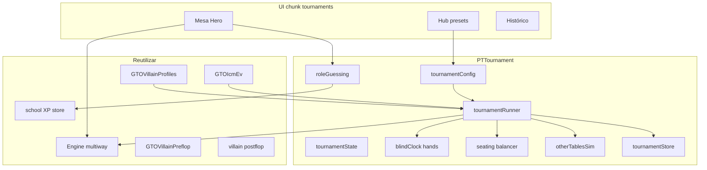

# Plan — Menú Torneos (juego completo vs IA)

> Producto: pestaña de primer nivel **Torneos**, admin-only en esta fase.  
> Alcance field: SNG 1 mesa (6-Max / 9-Max) + MTT pequeños (18–90). Sin fields 100+.  
> Reloj: ciegas por **número de manos** (no por tiempo).  
> El hub MTT de Entrenar (spots GTO) **no se toca**.

---

## 1. Objetivo de producto

Un modo de juego (no estudio por spots) donde el Hero juega un torneo completo contra villanos IA:

- Presets Fácil / Medio / Difícil + **configuración completa de parámetros**.
- Mesa del Hero jugable mano a mano; otras mesas (si MTT) simuladas.
- Subida de ciegas por manos jugadas en el torneo.
- HUD de mesa con posición de field (`5/15 (40)`), panel **Info** con avance, y villanos con **nombre propio**.
- Eliminación / victoria, payout, clasificación y stats.
- Persistencia histórica.
- Identificar roles de villanos (click → guess) → XP al cerrar el torneo.

---

## 2. UX y acceso

### Navegación

- Nueva pestaña `data-tab="tournaments"` / `#tab-tournaments` en [`index.html`](../index.html).
- Label: **Torneos**.
- Visible solo si `PTAdmin.hasAccess()` (mismo patrón que admin / legendary).
- Gate en `goToTab` / `goToTabUnlocked` en [`app.js`](../js/app.js): no-admin → home.
- Community: ocultar en configs que no sean pokerforge admin; no añadir a MTT LAB menús públicos.
- Lazy chunk `tournaments` en [`pt-loader.js`](../js/pt-loader.js) (como `legendary` / `school`).

### Pantallas del tab

| Vista | Contenido |
|-------|-----------|
| Hub | Presets + «Personalizado» + acceso a Histórico |
| Setup custom | Formulario completo de parámetros (ver §3.1) |
| Mesa activa | HUD torneo + mesa Hero + rivales con nombre, clickables |
| Entre manos / break | Clasificación viva, mesas restantes, próximo nivel de ciegas |
| Resultado | Puesto, prize, ROI, stats Hero, score de roles, XP ganado |
| Histórico | Lista de torneos guardados + detalle |

---

## 3. Presets predefinidos

| Preset | Tipo | Entries | Seats | Buy-in | Starting | Paid | Mix roles (aprox.) | Explotativo |
|--------|------|---------|-------|--------|----------|------|--------------------|-------------|
| Fácil | MTT 18 | 18 | 6 | 5€ | 1500 | 3 (topheavy suave) | fish 45 · nit 20 · tag 15 · lag 10 · maniac 10 · pro 0 | 0% |
| Medio | MTT 27 | 27 | 9 | 11€ | 3000 | 4 | fish 20 · nit 15 · tag 30 · lag 20 · maniac 5 · pro 10 | ~10% pros |
| Difícil | MTT 45 | 45 | 9 | 22€ | 5000 | 7 | fish 5 · nit 10 · tag 25 · lag 20 · maniac 5 · pro 35 | ~40% de los `pro` con `proStyle: exploit_pool` |
| SNG 6-Max | SNG | 6 | 6 | 5€ | 1500 | 2 | segúnable (default medio) | según mix |
| SNG 9-Max | SNG | 9 | 9 | 11€ | 3000 | 3 | configurable | según mix |

Payouts: reutilizar ladders existentes (`standard` / `flat` / `topheavy`) de taxonomía MTT / ICM lite.

### 3.1 Parámetros configurables (setup Personalizado)

Todos los presets se pueden clonar y editar. Validación: `entries ≤ 90`, `seats ∈ {6,9}`, `placesPaid < entries`, schedule con ≥1 nivel.

| Grupo | Campos |
|-------|--------|
| Identidad | Nombre del torneo |
| Field | Tipo SNG/MTT, entries (6–90), seats/mesa (6 u 9) |
| Economía | Buy-in €, starting stack (fichas), places paid, ladder payout |
| Estructura | Schedule de blinds: por cada nivel SB, BB, ante, **manos de duración** |
| Rivales | Pesos % por rol (`fish/nit/tag/lag/maniac/pro`), % de pros explotativos |
| Fin de torneo | Al bustearse Hero: preguntar / simular resto / finalizar |

UI: formularios con chips/inputs numéricos (mismo lenguaje visual que setup de Entrenar). Botón «Empezar torneo» crea el `TournamentState` con nombres de villanos y roles asignados.

---

## 4. Arquitectura



### Módulos nuevos (propuestos)

| Archivo | Responsabilidad |
|---------|-----------------|
| `js/tournament/config.js` | Presets, normalize, validación |
| `js/tournament/blinds.js` | Estructura por manos; nivel actual |
| `js/tournament/state.js` | Field, mesas, stacks chips, alive, places |
| `js/tournament/seating.js` | Asignación inicial, rebalance, bust-out, FT |
| `js/tournament/runner.js` | Loop: mano Hero → sync field → ¿eliminado/win? |
| `js/tournament/other-tables.js` | Simulación rápida AI-vs-AI |
| `js/tournament/hand-bridge.js` | Adaptar state → `playConfig` + stacks absolutos → `Engine` |
| `js/tournament/role-guess.js` | Guesses, resolve al final, XP |
| `js/tournament/names.js` | Pool de nicks únicos para villanos |
| `js/tournament/stats.js` | Stats de sesión de torneo (VPIP/PFR/AF lite, ITM, ROI…) |
| `js/tournament/hud.js` | Chips HUD + filas del modal Info |
| `js/tournament/store.js` | Persistencia local + hook cloud |
| `js/tournament/ui.js` | Render hub / setup params / mesa / resultado / histórico |
| `js/tournament/index.js` | API pública `PTTournaments` |

Bundle: chunk `tournaments` en loader + `bundle-chunks.js`.

---

## 5. Modelo de datos

### `TournamentConfig`

```js
{
  id, name, kind: 'sng' | 'mtt',
  entries, seatsPerTable, buyInEur, startingStack,
  placesPaid, payoutLadder: 'standard' | 'flat' | 'topheavy',
  blindSchedule: [{ level, sb, bb, ante, hands }], // hands = duración del nivel
  roleWeights: { fish, nit, tag, lag, maniac, pro },
  exploitProPct: 0..1,  // fracción de pros con exploit_pool
  onBust: 'simulate' | 'end' | 'ask'  // default ask al bust
}
```

### `TournamentState` (runtime)

```js
{
  id, config, seed, startedAt, status: 'running'|'finished',
  handIndex,  // manos globales del reloj (incrementa cada mano en mesa Hero; otras mesas sincronizan por nivel)
  blindLevel,
  players: [{
    id, name,           // name: nick visible en asiento (Hero = «Héroe» o nick usuario)
    stack, roleId, proStyle,
    tableId, seat, alive, isHero, bustPlace
  }],
  tables: [{ id, seatIds[], isHeroTable }],
  heroGuesses: { [playerId]: roleId },
  events: [],  // eliminaciones, merges, nivel up
  result: null | { place, prizeEur, roleScore, xpGained, stats }
}
```

Chips en **fichas absolutas** (no bb) en el state del torneo; el bridge convierte a bb para `Engine` según ciegas actuales.

### Rank de field (para HUD)

```js
// rankByStack: 1 = chip leader entre vivos
heroPlace = rankByStack(hero)           // p.ej. 5
playersLeft = count(alive)              // p.ej. 15
entriesTotal = config.entries           // p.ej. 40
// Chip HUD: "5/15 (40)"
```

---

## 6. Reloj de ciegas (por manos)

- Cada entrada del schedule dura `hands` manos **de la mesa del Hero** (contador claro y predecible).
- Al completar N manos del nivel → subir SB/BB/ante; anunciar en HUD.
- Otras mesas no llevan reloj propio: al simular un “bloque”, usan el **mismo nivel** que la mesa Hero.
- Schedule default ejemplo (rápido):

| Nivel | SB/BB | Ante | Manos |
|------:|-------|------|------:|
| 1 | 10/20 | 0 | 8 |
| 2 | 15/30 | 0 | 8 |
| 3 | 25/50 | 5 | 8 |
| 4 | 50/100 | 10 | 8 |
| 5 | 75/150 | 15 | 8 |
| 6 | 100/200 | 25 | 8 |
| … | … | … | … |

Custom editable; presets traen schedule fijo acotado a torneo rápido.

---

## 7. Loop de juego

### Mesa Hero (jugable)

1. `hand-bridge` construye mano “cash-like multiway” forzada:
   - `gameType` cash6/cash9 según seats vivos en mesa.
   - Stacks por asiento desde state (convertidos a bb).
   - Perfiles fijados por `player.roleId` (no re-roll por mano).
   - Escenario: **juego libre de mesa completa** (deal completo + acción preflop desde UTG), no spot trainer.
2. UI de mesa reutiliza tapete / asientos de Entrenar en modo torneo (flag `tournamentMode`), **sin** grading GTO por decisión (o grading opcional off).
3. Al acabar la mano: actualizar stacks, detectar busts en mesa Hero, rotar botón, `handIndex++`, check blind up, rebalance si hace falta.

### Extensión de Engine necesaria

Hoy `Engine.newHand` está orientado a **escenarios**. Para torneos hace falta un camino:

- `Engine.newTournamentHand(tableSpec)` o `playConfig.tournamentLive: true` que:
  - Reparte a todos los asientos vivos.
  - Pone ciegas/antes reales desde schedule.
  - Empieza la acción en orden de posición (villanos actúan solos hasta decisión Hero / showdown).
  - Reutiliza `villainPreflop` + postflop + multiway ya existentes.

Esta es la pieza más invasiva; el resto del runner cuelga de ella.

### Otras mesas (MTT)

- Tras cada mano Hero (o cada N manos), `other-tables` avanza las mesas satélite al mismo blind level.
- Simulación **acelerada**: no render; AI vs AI con la misma política de villanos; muestreo de outcomes (all-ins simplificados + folds preflop) para no bloquear UI.
- Eliminaciones → `bustPlace` global (field restante).
- Cuando `aliveCount ≤ seatsPerTable` → merge a mesa final; Hero se sienta con stacks reales.

### Bust / win

- Hero bust → popup: **Simular resto** | **Finalizar ya**.
  - Simular: `other-tables` + mesa residual AI hasta repartir todo el prizepool; Hero conserva su puesto.
  - Finalizar: cerrar con puesto actual; no calcular puestos ajenos finos (solo place Hero + prize).
- Hero gana (último vivo) → resultado 1º + prize.

---

## 8. Nombres de villanos

- Al crear el torneo, cada rival recibe un **nick único** de un pool (`js/tournament/names.js`: ~80–120 nicks estilo sala, sin PII).
- El asiento en mesa **no** muestra solo la posición de motor (`UTG`, `CO`…): muestra el nick como título principal y la posición/stack como meta secundaria.
- Formato de asiento (mesa Torneos):

```text
  Alex_92          ← nombre identificativo (clickable → guess de rol)
  CO · 31.1 bb     ← posición de mesa + stack en bb
  FOLD / apuesta   ← acción actual
```

- Hero: etiqueta «Héroe» (o display name de cuenta si existe), más posición de mesa (`Héroe · SB`).
- Los nombres persisten en histórico y en la pantalla de resultado (lista rol real vs guess por nick).
- Si un villano se mueve de mesa en un rebalance MTT, conserva el mismo `id` + `name` + `roleId`.

---

## 9. Roles de villanos e identificación

### Asignación al crear el torneo

- Pesos del config → `roleId` por jugador (excepto Hero).
- Si `roleId === 'pro'` y `random() < exploitProPct` → `proStyle: 'exploit_pool'` (vía [`villainProExploit.js`](../js/engine/villainProExploit.js)).
- Perfiles **estables** toda la vida del torneo (a diferencia del trainer que puede reasignar).

### UI de guess

- Click en el asiento / nombre del villano → modal con los 6 arquetipos (`tag`, `lag`, `nit`, `fish`, `maniac`, `pro`).
- El modal muestra el **nombre** del villano; indicador visual si ya hay guess (p.ej. borde o icono, sin revelar si es correcto).
- Se puede cambiar el guess mientras el villano esté vivo.
- No revelar el rol real hasta el **fin del torneo** (ni al bustearse ese villano, para no spoilear mesa).

### Scoring al cerrar

- Por cada villano que Hero haya marcado: acierto = +XP, fallo = 0 (v1 solo exact match).
- XP: escribir en progreso Escuela (`stats.school.xp`) reutilizando `levelFromXp` / store school, con clave de origen `tournament:{id}` para no duplicar.
- Mostrar en resultado: aciertos/total, XP, lista revelada `nombre · rol real · tu guess`.

---

## 10. HUD de mesa e Info (chrome torneo)

Reutiliza el patrón visual de Entrenar (`table-train-hud` + botón **Info** / modal `#session-config-modal`), pero con datos de torneo vivo — no chips simbólicos de estudio.

### Chips superiores (compactos)

Fila tipo la del entrenador (badge formato + chips + Info), adaptada:

| Chip | Ejemplo | Significado |
|------|---------|-------------|
| Formato | `SNG` / `MTT` | Tipo de torneo |
| Stack Hero | `42bb` | Stack actual del Hero en bb del nivel |
| **Posición field** | **`5/15 (40)`** | Puesto por stack entre vivos / jugadores restantes / entries totales |
| Ciegas | `Nv.3 · 25/50` | Nivel actual (reloj por manos) |
| Info | botón | Abre detalle (abajo) |

Regla del chip de posición: `heroPlace/playersLeft (entriesTotal)`. Se recalcula tras cada mano y tras sims de otras mesas (eliminaciones fuera de la mesa Hero cambian el denominador).

En móvil se priorizan **formato + posición + Info** (máx. ~3 chips visibles; el resto vive en Info).

### Panel Info (modal)

Al pulsar **Info**, filas (`dl`) con el avance del torneo:

| Label | Valor ejemplo |
|-------|---------------|
| Torneo | MTT 45 · Difícil |
| Avance | Nivel 3 · 5/8 manos hasta ciegas |
| Posición | 5º de 15 restantes (40 iniciales) |
| Stack Hero | 2 100 (42 bb) |
| Media de fichas | 1 800 (36 bb) — promedio de jugadores vivos |
| Burbuja / ITM | 15 left · 7 paid (falta 8 para ITM) |
| Puestos premiados | 1º 40% · 2º 22% · … (ladder del config) |
| Buy-in / prize pool | €22 · pool €990 |
| Mesas | Hero en mesa 2 · 3 mesas activas |
| Ciegas actuales | 25/50 ante 5 |
| Próximo nivel | 50/100 ante 10 (en 3 manos) |

Misma UX de modal que Entrenar (`openSessionConfigModal` / `buildSessionConfigRows`), implementada en `tournament/hud.js` para no contaminar el chrome del trainer.

---

## 11. Estadísticas e histórico

### Stats por torneo (Hero)

- Hands played, VPIP/PFR/AF aproximados desde acciones registradas.
- All-in EV chips (si hay showdowns), stack graph (handIndex → stack).
- Place, prize, invested, profit, ROI.
- Role accuracy %.

### Persistencia

- `Store` keys nuevas: `pt_tournaments_v1[_uid]` (lista, cap ~100) + opcional detalle por id.
- Sync cloud: extender payload `pt_user_state` con `tournaments` (mismo camino que history/stats) **o** tabla dedicada si el blob crece; v1 blob scoped como school.
- Histórico UI: filtros SNG/MTT, preset, fecha; drill-down al resultado.

---

## 12. Integración UI mesa

- Reutilizar patrón de tapete de Entrenar **clonando markup** en `#tab-tournaments` (no compartir `#play-active`) para no romper sesión de Entrenar / school / legendary.
- Controles: Fold / Check-Call / Bet-Raise / All-in (sin grading GTO ni “siguiente spot”).
- Asientos: nombre del villano clickable + stack bb + acción; Hero abajo con cartas.
- Watermark distinto al de entrenamiento (p.ej. «MODO TORNEO»), sin copy de estudio GTO.
- HUD e Info según §10.

---

## 13. Admin-only y flags

- `tournamentsMenuVisible()` = `PTAdmin.hasAccess()` && !demo.
- Tab button `.hidden` por defecto; `syncTournamentsMenu()` al auth change (como legendary).
- Feature flag `PT_TOURNAMENTS_ENABLED = true` por si hay que apagar sin quitar código.
- Sin marketing landing / home card pública en esta fase.

---

## 14. Plan de implementación (fases)

### Fase A — Cimientos
1. Tab + gate admin + chunk vacío.
2. `config` + presets + **formulario de parámetros** + blinds schedule.
3. `names` + `state` + seating SNG (1 mesa, nicks únicos).

### Fase B — Juego SNG
4. `Engine` camino `tournamentLive` (mesa completa).
5. UI mesa (nombres en asientos) + loop manos + blind up por manos.
6. HUD chips `5/15 (40)` + modal Info (avance, media bb, puestos premiados).
7. Bust/win + resultado + store histórico.

### Fase C — Roles y XP
8. Asignación estable de roles + guess UI por nombre.
9. Resolución + XP school al finalizar.

### Fase D — MTT pequeño
10. Multi-mesa: seating 18/27/45.
11. `other-tables` sim + merges hasta FT; HUD/Info se actualizan con field global.
12. Presets Fácil/Medio/Difícil + custom completo.
13. Opción simular resto tras bust.

### Fase E — Pulido
14. Stats/gráficas, tests unitarios (`tools/test-tournament-*.js`), regresión admin gate.
15. Copy i18n ES mínima del chrome del tab.

---

## 15. Tests mínimos

- `test-tournament-config.js` — presets normalize, caps entries≤90, params custom.
- `test-tournament-blinds.js` — level por handIndex.
- `test-tournament-seating.js` — bust, rebalance, FT.
- `test-tournament-names.js` — nicks únicos, sin colisión en field ≤90.
- `test-tournament-hud.js` — formato chip `place/left (total)` + filas Info (media bb, paid).
- `test-tournament-roles.js` — weights + exploit pct + guess scoring.
- `test-tournament-admin-gate.js` — tab oculto sin admin.
- Smoke SNG 6-max: simular N manos AI-only hasta un ganador (sin UI).

---

## 16. Fuera de alcance (esta fase)

- Fields 100+.
- Reloj por tiempo real.
- Multimesa con Hero saltando de mesa (solo una mesa Hero).
- Grading GTO obligatorio por calle (el valor es jugar el torneo, no el score spot).
- Sustituir hub Torneos de Entrenar.
- Apertura a usuarios no-admin.

---

## 17. Riesgos técnicos

| Riesgo | Mitigación |
|--------|------------|
| Engine solo sabe de escenarios | Aislar `tournamentLive` deal+acción; no mezclar con charts de setup |
| Simulación otras mesas lenta | Modelo simplificado preflop-heavy + all-in equity sample |
| Conflicto con sesión Entrenar | Mesa y state propios en chunk tournaments |
| Blob cloud grande | Cap histórico + resumen sin hand histories completas |
| Balance AI en late ICM | Reusar `GTOIcmEv` + pushFold en short; no pretender solver FT |
