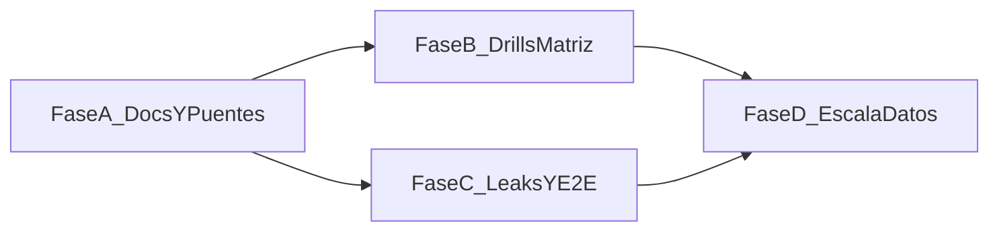

# RoadMap — Escuela de Rangos (Laboratorio)

> Diagnóstico de producto y plan de mejora para la ruta **Rangos** de Escuela de Póker («Laboratorio de rangos»).  
> **Alcance de este documento:** estado real vs promesa original, gaps, prioridades y fases de entrega.  
> Complementa: [`ROADMAP_LECCIONES_DIRIGIDAS.md`](ROADMAP_LECCIONES_DIRIGIDAS.md) (§12 / §13 / §14), [`ESTUDIO_PRODUCTO_Y_MERCADO_AGOSTO_2026.md`](ESTUDIO_PRODUCTO_Y_MERCADO_AGOSTO_2026.md), explorer [`js/range-matrix.js`](../js/range-matrix.js).  
> Fecha: agosto 2026 · Producto: PokerForgeAI

---

## Tabla de contenidos

1. [Resumen ejecutivo](#1-resumen-ejecutivo)
2. [Vista rápida: qué habrá de nuevo tras implantar](#2-vista-rápida-qué-habrá-de-nuevo-tras-implantar)
3. [Qué es y dónde vive](#3-qué-es-y-dónde-vive)
4. [Estado real (inventario)](#4-estado-real-inventario)
5. [Promesa original vs realidad](#5-promesa-original-vs-realidad)
6. [Diagnóstico: fortalezas y debilidades](#6-diagnóstico-fortalezas-y-debilidades)
7. [Lo que aún falta (backlog priorizado)](#7-lo-que-aún-falta-backlog-priorizado)
8. [Plan de entrega por fases](#8-plan-de-entrega-por-fases)
9. [Monetización y gates (fuente de verdad)](#9-monetización-y-gates-fuente-de-verdad)
10. [Arquitectura y deuda técnica](#10-arquitectura-y-deuda-técnica)
11. [Métricas de éxito](#11-métricas-de-éxito)
12. [Decisiones cerradas en este RoadMap](#12-decisiones-cerradas-en-este-roadmap)
13. [Glosario y archivos clave](#13-glosario-y-archivos-clave)

---

## 1. Resumen ejecutivo

La ruta **Rangos** ya no es un teaser de 6 lecciones: hay **27 lecciones (R-01…R-27)** en módulos M0–M4, con teoría, packs de práctica y un bloque fuerte de **lectura de línea + quiz de villano** (R-05, R-07…R-27). Escuela está **pública para usuarios autenticados** (`SCHOOL_PUBLIC = true` en código).

El gap pedagógico principal no es «falta contenido», sino **desalineación entre cómo se enseña la matriz y cómo se practica**:

| Promesa (roadmap original) | Realidad actual |
|----------------------------|-----------------|
| R-01 = Quiz UI de matriz 13×13 | Open/fold con teachbacks sobre celdas; el usuario debe ir solo al menú Rangos |
| R-02 = Matriz interactiva (construir RFI) | Open/fold BTN; «60 s» solo en copy |
| Laboratorio = 6 lecciones | 27 lecciones; M2–M4 son quizzes de línea |
| Menú Escuela admin-only | Público si hay login |
| Free solo R-01 | Free = R-01…R-03 |

**Veredicto:** el Laboratorio es maduro en *lectura de rango tras línea* y débil en *alfabetización de chart*. El siguiente salto de producto es cerrar el puente Escuela ↔ pestaña Rangos y cumplir R-01/R-02 como drills de matriz, no como RFI genérico.

---

## 2. Vista rápida: qué habrá de nuevo tras implantar

Resumen orientado a **funcionalidad de producto** (lo que el usuario verá o podrá hacer). Lo que ya existe hoy (27 lecciones, quizzes de línea, gates Free/Study/Coach) no se repite aquí.

### 2.1 De un vistazo — hoy vs después

| Capacidad | Hoy | Tras implantar (A–D) |
|-----------|-----|----------------------|
| Aprender a **leer** la matriz 13×13 | Solo texto + “ve al menú Rangos” | **Quiz interactivo** dentro de R-01 (señalar celdas, comparar anchos, leer %) |
| **Construir** un RFI de memoria | Drill mental en copy + open/fold | **Pintar el rango** en la matriz (R-02, ~60 s) con nota de solapamiento |
| Ir del Laboratorio al chart real | Cambio manual de pestaña | Botón **«Abrir chart»** con posición/contexto ya puestos |
| Ver el chart **sin salir** de la lección | No | **Mini-matriz** en la ficha (R-01…R-04) |
| De un **leak** a una lección de rangos | Solo lecciones Cash (`C-*`) | CTA también a **R-02 / R-04 / R-05…** según el leak |
| De Cash/Spins/MTT al Laboratorio | Mención en texto | Botón **«Ir a lección R-0x»** |
| Examen de módulo Rangos | No | Packs **examen** M1/M2 (opcional, Fase D) |
| Escuela en inglés | No (ES-only de facto) | Label explícito ES-only **o** títulos/conceptos i18n |
| Calidad interna (no UI) | Packs monolíticos, seeds dup, sin E2E Escuela | Generador/split de packs, seeds únicos, **E2E** del hub Rangos |

### 2.2 Funcionalidades nuevas (detalle por pieza)

#### A. Puentes Escuela ↔ Rangos (Fase A)

| Funcionalidad nueva | Qué hace el usuario | Dónde aparece |
|---------------------|---------------------|---------------|
| **Abrir chart con contexto** | Pulsar un CTA y aterrizar en la pestaña Rangos ya en RFI BTN (u otra posición), sin reconfigurar a mano | Ficha R-01 / R-02 (teoría y ejemplos) |
| **Salto a lección del Laboratorio** | Desde una lección Cash/Spins/MTT que hable de charts, ir directo a R-01 o R-02 | Teoría de p. ej. C-02 (RFI) y equivalentes |

*No es un feature “grande” de UI, pero elimina la fricción que hoy rompe el loop de estudio.*

#### B. Drills de matriz — el salto de producto (Fase B)

| Funcionalidad nueva | Qué hace el usuario | Cómo se aprueba |
|---------------------|---------------------|-----------------|
| **Quiz de matriz (R-01)** | Sobre un grid 13×13: localizar manos (99, ATs, KJo), decir si BTN es más wide que UTG, interpretar un % en una celda | Acierto en las preguntas del drill (ya no basta open/fold a ciegas) |
| **Construir RFI (R-02)** | Cronómetro ~60 s: marcar/desmarcar celdas hasta acercarse al RFI BTN de referencia de la app | Score por solapamiento (y penalización de manos de más / de menos) |
| **Preview de matriz en ficha** | Ver el chart relevante mientras lee la teoría, sin cambiar de pestaña | Apoyo visual; no sustituye al drill |

*Estas dos lecciones dejan de parecer “otra sesión de open/fold” y pasan a ser el onboarding real del producto Rangos.*

#### C. Remediation y retención (Fase C)

| Funcionalidad nueva | Qué hace el usuario | Efecto de producto |
|---------------------|---------------------|--------------------|
| **CTA leak → lección Rangos** | En Errores/leaks: «Ver lección» también puede abrir R-02 (RFI), R-04 (blockers), R-05/R-07 (línea) | El Laboratorio deja de ser una isla; el estudio reactivo alimenta la ruta Rangos |
| **Dual CTA Cash + Rangos** (si aplica) | Elegir “práctica de spot” (C-*) o “entender el chart/línea” (R-*) | Misma fuga, dos remedios |
| **E2E Laboratorio** | (interno) CI cubre hub → ruta Rangos → R-01 | Menos regresiones al tocar Escuela |

#### D. Escala y cierre de currículum (Fase D)

| Funcionalidad nueva | Qué hace el usuario / el equipo | Notas |
|---------------------|----------------------------------|-------|
| **Exámenes de módulo** | Sesión mezcla de trampas M0/M1 o M2 para certificar el bloque | Opcional; mismo patrón que exams Cash |
| **i18n o sello ES-only** | Usuario EN ve Escuela traducida **o** aviso claro de que Escuela es ES | Decisión de producto, no ambas a la vez en v1 |
| **Pipeline de packs de línea** | (interno) editar M2/M3/M4 sin un archivo de 5,6k líneas | Habilita más contenido «¿Qué tiene?» más barato |

### 2.3 Qué *no* cambia con este plan

- Siguen existiendo las **27 lecciones** y los quizzes «¿Qué tiene?» de M2–M4.
- **No** se sustituye el motor por un solver completo.
- **No** se fusionan la pestaña Rangos (explorer) y la ruta Escuela; se **conectan**.
- Free sigue pudiendo hacer **R-01…R-03** (no se recorta a solo R-01).

### 2.4 Orden de aparición para el usuario

```text
Fase A  →  “Desde la lección abro el chart / salto a R-02”
Fase B  →  “En R-01 señalo celdas; en R-02 pinto el RFI”
Fase C  →  “Mi leak de RFI me manda al Laboratorio”
Fase D  →  “Hago el examen del módulo” (+ Escuela EN o sello ES)
```

---

## 3. Qué es y dónde vive

### 3.1 Naming

| Nombre en UI / docs | Significado |
|---------------------|-------------|
| **Escuela de Póker** | Hub de lecciones (Cash / Spins / MTT / Rangos) |
| **Rangos** (ruta Escuela) | Laboratorio pedagógico R-01…R-27 |
| **Rangos** (pestaña app) | Explorer 13×13 (`range-matrix.js`) — distinto producto |

Este documento trata la **ruta Escuela → Rangos**. La pestaña explorer es dependencia de UX, no el Laboratorio en sí.

### 3.2 Loop de una lección

```
Hub Escuela → pestaña Rangos → mapa M0–M4 → ficha lección
  → teoría + ejemplos + chips ForgeCoach
  → Empezar sesión (schoolMode en entrenador)
  → spots fijos (± villainQuiz en river)
  → % vs pass/gold → XP / estrellas / desbloqueo
```

### 3.3 Piezas de código

| Archivo | Rol |
|---------|-----|
| [`js/school.js`](../js/school.js) | Hub, gates, runner, `SCHOOL_PUBLIC` |
| [`js/school-data-ranges.js`](../js/school-data-ranges.js) | Metadatos R-01…R-27; activa ruta `ranges` |
| [`js/school-data-practice.js`](../js/school-data-practice.js) | Packs R-01…R-06 |
| [`js/school-data-ranges-line.js`](../js/school-data-ranges-line.js) | Packs línea + quiz R-05, R-07…R-27 (~5,6k líneas) |
| [`tools/pedagogy-content/ranges.js`](../tools/pedagogy-content/ranges.js) | Fuente de teoría (patch pedagogy) |
| [`js/range-matrix.js`](../js/range-matrix.js) | Explorer (pestaña Rangos) |
| [`tools/test-school.js`](../tools/test-school.js) | Asserts de currículum / quizzes / gates |

---

## 4. Estado real (inventario)

### 4.1 Currículum R-01…R-27

Todas las lecciones: `route: ranges`, 12 manos, umbrales de práctica reescritos a pass ≈ 0,7 / gold ≈ 0,9 donde aplica.

| ID | Título (concepto) | Módulo | Plan | Tipo de práctica |
|----|-------------------|--------|------|------------------|
| R-01 | Leer un range chart 13×13 | M0 | free | Preflop RFI open/fold |
| R-02 | Construir RFI BTN en 60 s | M0 | free | Preflop RFI BTN |
| R-03 | Qué % del rango conecta un board | M0 | free | Flop / textura |
| R-04 | Eliminación de combos (blockers) | M1 | study | 3-bet / face 3-bet |
| R-05 | Asignar rango rival tras una línea | M1 | study | **Línea + villainQuiz** |
| R-06 | Node frequencies (pro) | M1 | study | Flop / frecuencias |
| R-07…R-11 | ¿Qué tiene? · Lectura I–V | M2 | study | Línea + quiz |
| R-22, R-23 | ¿Qué tiene? · Faroles por línea I–II | M2 | study | Línea + quiz |
| R-12…R-16 | ¿Qué tiene? · Polar y faroles I–V | M3 | coach | Línea + quiz |
| R-24, R-25 | ¿Qué tiene? · Faroles difíciles I–II | M3 | coach | Línea + quiz |
| R-17…R-21 | ¿Qué tiene? · Lectura avanzada I–V | M4 | coach | Línea + quiz |
| R-26, R-27 | ¿Qué tiene? · Faroles avanzados I–II | M4 | coach | Línea + quiz |

Orden de desbloqueo lineal por `order` (los packs de farol R-22…R-27 van intercalados tras el bloque de lectura del mismo módulo).

### 4.2 Ya entregado (no reabrir sin motivo)

- Ruta activa en hub Escuela + mapa M0–M4.
- Teoría / ejemplos / `aiQuestions` para las 27 lecciones (voz ES-ES validada en tests).
- Runner de sesión en `schoolMode` con feedback, pass/gold/perfect, share spoiler-free en quizzes de línea.
- Gates Free / Study / Coach por lección.
- Tests unitarios fuertes en `tools/test-school.js` (presencia, planes, integridad de quizzes river, unlock).
- Escuela visible a usuarios con login (`SCHOOL_PUBLIC = true`).

---

## 5. Promesa original vs realidad

Fuente: [`ROADMAP_LECCIONES_DIRIGIDAS.md`](ROADMAP_LECCIONES_DIRIGIDAS.md) §12.1, §13, §14 (parcialmente **obsoleto** respecto al código).

| Ítem | Roadmap original | Código hoy | Estado |
|------|------------------|------------|--------|
| R-01 Quiz UI matriz | Sí | Open/fold + copy «abre menú Rangos» | **Falta** |
| R-02 Interactive matrix | Sí | Open/fold + drill mental en teoría | **Falta** |
| R-03…R-06 type C | Sí | Hecho (R-05 elevado a línea+quiz) | Hecho / evolucionado |
| Solo R-01…R-06 | Fase I | R-07…R-27 añadidos | Hecho (ampliado) |
| Free = solo R-01 | §13 | Free = R-01…R-03 | **Divergencia** (código gana) |
| Study ≈ R-01…R-03 | §13 | Study hasta M2 (incl. R-22/23) | **Divergencia** (código gana) |
| Menú admin-only | §14 | Público con auth | **Divergencia** (código gana) |
| Fase J leaks → Escuela | CTA con `lessonId` | Solo `C-*` en `TRAINING_FOCUSES` | **Parcial** (Rangos ausente) |
| Deep-link a explorer | Implícito en copy | No hay `goToTab('ranges')` desde Escuela | **Falta** |
| E2E Escuela Rangos | No especificado | Solo smoke de pestaña Rangos | **Falta** |

**Regla de este documento:** cuando doc y código discrepan en visibilidad o planes, **el código es la fuente de verdad**; el trabajo de sync es actualizar docs, no revertir producto sin decisión explícita.

---

## 6. Diagnóstico: fortalezas y debilidades

### 6.1 Fortalezas

1. **Diferenciador claro en M2–M4:** quizzes «¿Qué tiene?» sin spoiler de categoría en el título; encaja con el moat ES + narrativa.
2. **Progresión Free → Study → Coach** visible en el mapa (upsell natural sin inventar otro paywall).
3. **Reutiliza el entrenador** (grading, seeds, ForgeCoach) en lugar de un segundo player.
4. **Cobertura de tests de contenido** por encima de la media del repo para packs autorados.

### 6.2 Debilidades

1. **Onboarding de matriz roto pedagógicamente:** R-01/R-02 evalúan open/fold; se puede aprobar sin localizar una celda en el chart.
2. **Fricción de contexto:** la teoría manda al menú Rangos, pero no hay CTA ni deep-link; el alumno sale del loop Escuela.
3. **Leaks no remiten a Rangos:** un leak de RFI manda a C-02, nunca a R-02 / R-04.
4. **Deuda de datos:** `school-data-ranges-line.js` monolítico (~302 KB); seeds duplicados en R-07…R-21.
5. **Docs desactualizados** (headers «admin-only», tablas Free/Study del roadmap madre).
6. **Sin E2E** del hub Rangos ni del flujo quiz de línea.
7. **School copy solo ES** (aceptable a corto plazo; documentar como decisión de producto).

### 6.3 Principio rector (igual que Escuela general)

> Una lección = **un trabajo mental**. Si R-01 se aprueba sin leer la matriz, el pack está mal diseñado.

---

## 7. Lo que aún falta (backlog priorizado)

Prioridad: **P0** bloquea calidad del Laboratorio · **P1** multiplica retención/upsell · **P2** higiene / escala.

### P0 — Cerrar la alfabetización de chart

| ID | Ítem | Descripción | Archivos / piezas |
|----|------|-------------|-------------------|
| **ER-01** | Deep-link Escuela → pestaña Rangos | Botón «Abrir chart» en teoría/ejemplos de R-01/R-02 (y CTA genérico en fichas que lo mencionen) con preset posición/fase si el explorer lo permite | `school.js`, `range-matrix.js`, posiblemente query/`__ptPendingRanges` |
| **ER-02** | Drill matriz R-01 (Quiz UI) | Sustituir o complementar el pack open/fold por preguntas del tipo: «señala 99 / ATs / KJo», «¿BTN más wide que UTG?», «¿qué % implica esta celda?» | Nuevo modo spot o UI embebida reutilizando grid del explorer |
| **ER-03** | Drill construir RFI R-02 | Modo «pinta el rango» o toggle celdas vs target RFI BTN en 60 s; score = overlap / errores | Grid interactivo + target desde `data/ranges` o engine |

### P1 — Puentes de producto

| ID | Ítem | Descripción |
|----|------|-------------|
| **ER-04** | Leaks → `R-*` | Extender `TRAINING_FOCUSES` / `lessonFromLeak`: RFI→R-02 (o C-02+R-02), blockers/3bet→R-04, postflop línea→R-05/R-07 | `ai-report.js`, `leaks.js`, tests |
| **ER-05** | Cross-links desde Cash/Spins/MTT | Donde la teoría diga «menú Rangos», añadir CTA «Ir a lección R-0x» además del explorer | `school-data.js`, `school-data-spin.js`, `school-data-mtt.js`, `school-data-m2.js` |
| **ER-06** | Preview matriz en ficha de lección | Mini-grid o captura estática del chart relevante en R-01…R-04 para no romper el loop | UI lección en `school.js` + CSS |
| **ER-07** | E2E Laboratorio | Spec: abrir Escuela → ruta Rangos → R-01 visible; opcional: un spot o un villainQuiz | `e2e/` |

### P2 — Higiene, escala y honestidad

| ID | Ítem | Descripción |
|----|------|-------------|
| **ER-08** | Sync docs | Actualizar §12–§14 de `ROADMAP_LECCIONES_DIRIGIDAS.md` + headers de `school-data-ranges.js` a `SCHOOL_PUBLIC=true` y tabla Free/Study/Coach real | Docs + comentarios |
| **ER-09** | Seeds únicos R-07…R-21 | Eliminar seeds duplicados dentro de cada pack (hoy 11 dups/pack) | `school-data-ranges-line.js` o regenerador |
| **ER-10** | Partir / generar packs de línea | Generador o split por módulo (M2/M3/M4) desde JSON pedagogy; dejar de editar 5,6k líneas a mano | `tools/` + chunks |
| **ER-11** | i18n Escuela | Marcar Escuela ES-only en producto **o** extraer títulos/conceptos a `i18n.js` | Decisión de producto |
| **ER-12** | Exámenes de módulo Rangos | Opcional: exam packs tipo Cash (mezcla trampas M0/M1) — no bloqueante | Contenido nuevo |

### Fuera de alcance de este RoadMap

- Sustituir heurísticas por árbol solver completo (sigue siendo estudio aproximado; ver honestidad en roadmap madre).
- B2B «escuelas poker» / afiliados (mercado O-04).
- Paridad Snowie postflop range viewer (EPIC_10) — afecta explorer, no el currículum Escuela.

---

## 8. Plan de entrega por fases

Complejidad relativa: **S** (acotado) · **M** · **L** (UI nueva o regeneración masiva). Sin estimaciones de calendario.

### Fase A — Verdad documental y puentes mínimos (S)

**Objetivo:** que el equipo y el producto hablen el mismo idioma; que el alumno no pierda el chart.

| Entrega | IDs | Criterio de hecho |
|---------|-----|-------------------|
| Sync docs + headers | ER-08 | Roadmap madre y comentarios coinciden con código |
| Deep-link «Abrir chart» | ER-01 | Desde R-01/R-02 se abre pestaña Rangos con contexto útil |
| CTA cross-route texto→lección | ER-05 (mínimo) | Al menos C-02 / RFI theory enlaza a R-01 o R-02 |

**Dependencias:** ninguna.  
**Riesgo:** bajo.

### Fase B — R-01 / R-02 como drills de matriz (L)

**Objetivo:** cumplir el trabajo mental prometido.

| Entrega | IDs | Criterio de hecho |
|---------|-----|-------------------|
| Quiz / localizar celdas | ER-02 | No se puede aprobar R-01 solo con open/fold ciego |
| Construir RFI BTN | ER-03 | Score basado en solapamiento con chart target |
| Preview en ficha (opcional en B) | ER-06 | Chart visible sin salir de la ficha |

**Enfoque técnico elegido:** reutilizar el grid de [`range-matrix.js`](../js/range-matrix.js) (o su renderer compacto) en modo `schoolDrill`, no inventar un tercer widget de matriz. Los packs open/fold actuales de R-01/R-02 pasan a ser **secundarios** o se retiran del umbral de aprobación.

**Dependencias:** Fase A (deep-link) conviene antes o en paralelo.  
**Riesgo:** medio — nuevo tipo de spot en el runner; hace falta contrato de scoring y tests en `test-school.js`.

### Fase C — Remediation y retención (M)

| Entrega | IDs | Criterio de hecho |
|---------|-----|-------------------|
| Leaks → R-* | ER-04 | Al menos 3 focuses con `lessonId` R-* o dual CTA |
| E2E Laboratorio | ER-07 | Spec verde en CI |
| Seeds únicos | ER-09 | Assert «no duplicate seeds per pack» en tests |

**Dependencias:** B no es estrictamente requerido para ER-04/ER-07.  
**Riesgo:** bajo–medio.

### Fase D — Escala de contenido (L)

| Entrega | IDs | Criterio de hecho |
|---------|-----|-------------------|
| Generador / split packs línea | ER-10 | Editar un módulo sin tocar 5k líneas ajenas |
| Exámenes módulo (opcional) | ER-12 | 1 exam M1 + 1 exam M2 si hay demanda |
| i18n o label ES-only | ER-11 | Decisión reflejada en UI/pricing copy |

**Dependencias:** estabilizar formato de spots tras Fase B.  
**Riesgo:** medio (migración de datos).



---

## 9. Monetización y gates (fuente de verdad)

Implementado en `canPlayLesson` / planes de lección (`js/school.js`, metadatos en `school-data-ranges.js`):

| Plan | Lecciones Rangos |
|------|------------------|
| **Free** | R-01, R-02, R-03 (M0 completo) |
| **Study** (`pro`) | R-04…R-11, R-22, R-23 (M1 + M2) |
| **Coach** (`premium`) | R-12…R-21, R-24…R-27 (M3 + M4) |

Además: desbloqueo **lineal** por orden en la ruta (hay que aprobar la anterior).

**Implicación de producto:** Free ya prueba el Laboratorio de verdad (3 lecciones). Study vende lectura de línea básica; Coach vende polar/faroles avanzados. No hace falta restringir Free a solo R-01 salvo experimento de conversión.

**Upsell copy sugerido (sin implementar aquí):** en el mapa, nodos Coach con preview del concepto «¿Qué tiene el rival tras bet-bet-shove?» — ya parcialmente cubierto por badges de plan.

---

## 10. Arquitectura y deuda técnica

```
index.html #tab-school
  └─ PTSchool
       ├─ PTSchoolData
       │    ├─ school-data-ranges.js      (meta R-01…R-27)
       │    ├─ school-data-practice.js    (R-01…R-06 spots)
       │    └─ school-data-ranges-line.js (R-05, R-07…R-27)
       ├─ Play / engine (schoolMode, villainQuiz)
       └─ PTSchoolShare

#tab-ranges (separado)
  └─ range-matrix.js ← engine/ranges + data/ranges/*.json
```

### Deuda a atacar en Fase D

- Monolito `school-data-ranges-line.js` (~5,6k líneas, patrón `LQ(...)` repetido).
- Seeds duplicados en R-07…R-21 (contenido distinto, seed igual → olor a copy-paste).
- Teoría duplicada entre `pedagogy-content/ranges.js` y `school-data-ranges.js` (el patch pedagogy debe seguir siendo el camino de edición).

### Contrato futuro para drills de matriz (Fase B)

Campos sugeridos en spot (borrador):

```text
kind: 'matrixQuiz' | 'matrixPaint'
prompt: string
target: { position, action: 'RFI', cells?: string[], chartKey?: string }
passRule: 'allCorrect' | 'overlap>=N'
```

El runner en `school.js` debe ramificar sin romper spots clásicos ni `villainQuiz`.

---

## 11. Métricas de éxito

| Métrica | Antes (hipótesis) | Objetivo tras Fase B |
|---------|-------------------|----------------------|
| Compleción R-01 → R-02 | Baseline analytics `lesson_complete` | +15 % relativo |
| Drop al salir a pestaña Rangos sin volver | Alto (fricción) | Baja tras ER-01/ER-06 |
| CTR CTA leak → lección R-* | 0 (no existe) | Medible tras ER-04 |
| % aprobación R-01 con acierto en localizar celdas | N/A | ≥ passThreshold del drill |
| Regresiones E2E Escuela | 0 cobertura | Spec estable en CI |

Instrumentación ya existente: `lesson_start` / `complete` / `fail` / `blocked_plan` / `share_panel`. Añadir evento `matrix_drill_score` en Fase B.

---

## 12. Decisiones cerradas en este RoadMap

1. **Código > docs** para `SCHOOL_PUBLIC` y mapa Free/Study/Coach de Rangos.
2. **R-01/R-02 deben evaluar matriz**, no solo open/fold; los packs actuales no bastan.
3. **Reutilizar el grid del explorer** para drills; no un tercer sistema de charts.
4. **Leaks priorizan Cash `C-*`**; se añaden `R-*` como remediation complementaria, no se borran los C-*.
5. **No se reduce** el Free a solo R-01 en este plan.
6. **Escuela Rangos permanece ES-first**; i18n completo es P2/ER-11, no bloquea B/C.

---

## 13. Glosario y archivos clave

| Término | Definición breve |
|---------|------------------|
| Laboratorio / ruta Rangos | Currículum R-01…R-27 en Escuela |
| Explorer Rangos | Pestaña app de matrices 13×13 |
| villainQuiz | Pregunta 3 opciones sobre rango/mano rival tras línea |
| schoolMode | Sesión del entrenador lanzada desde una lección |
| pass / gold | Umbrales de % para aprobar / maestría |

| Documento | Relación |
|-----------|----------|
| Este archivo | Plan vivo de mejora del Laboratorio |
| `ROADMAP_LECCIONES_DIRIGIDAS.md` | Diseño madre Escuela; §12–14 deben apuntar aquí tras ER-08 |
| `ESTUDIO_PRODUCTO_Y_MERCADO_AGOSTO_2026.md` | Contexto de pilares (Rangos como feature core) |

---

## Checklist rápido «¿está el Laboratorio terminado?»

- [x] 27 lecciones con teoría y spots (+ R-28/R-29 exámenes)
- [x] Quizzes de línea M2–M4
- [x] Gates Free/Study/Coach
- [x] Escuela pública con auth
- [x] R-01 Quiz UI de matriz (ER-02)
- [x] R-02 matriz interactiva (ER-03)
- [x] Deep-link a explorer (ER-01)
- [x] Leaks → R-* (ER-04)
- [x] E2E Laboratorio (ER-07)
- [x] Docs sync (ER-08)
- [x] Seeds únicos R-07…R-21 (ER-09)
- [ ] Packs de línea mantenibles / split generador (ER-10 — pendiente de refactor de archivo)
- [x] Sello ES-only Escuela (ER-11 — sin i18n; contenido en español)
- [x] Exámenes módulo M1/M2 (ER-12)

**Respuesta corta:** el Laboratorio ahora enseña charts (R-01/R-02), conecta con explorer/leaks y mantiene todo el copy en español. Queda deuda de mantener `school-data-ranges-line.js` partido/generado (ER-10).
